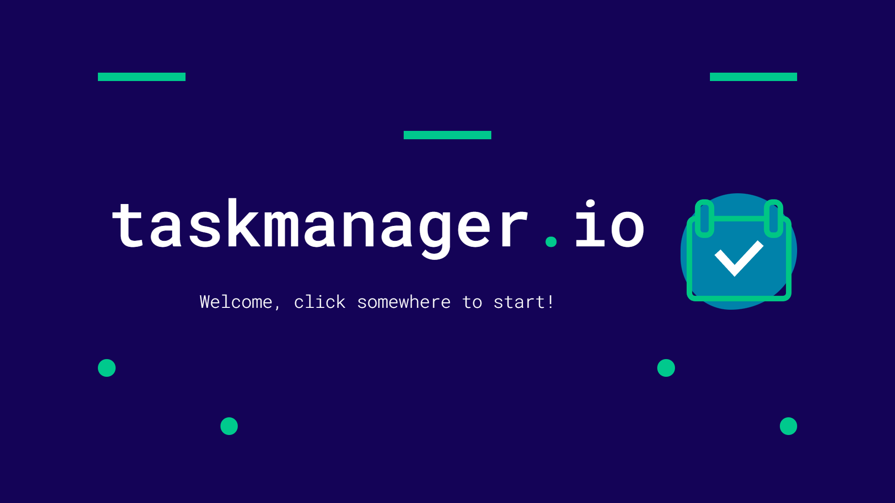
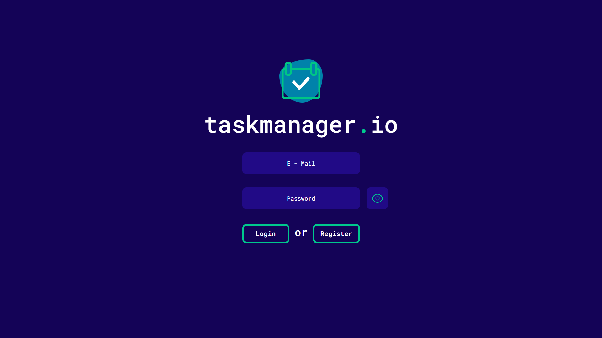
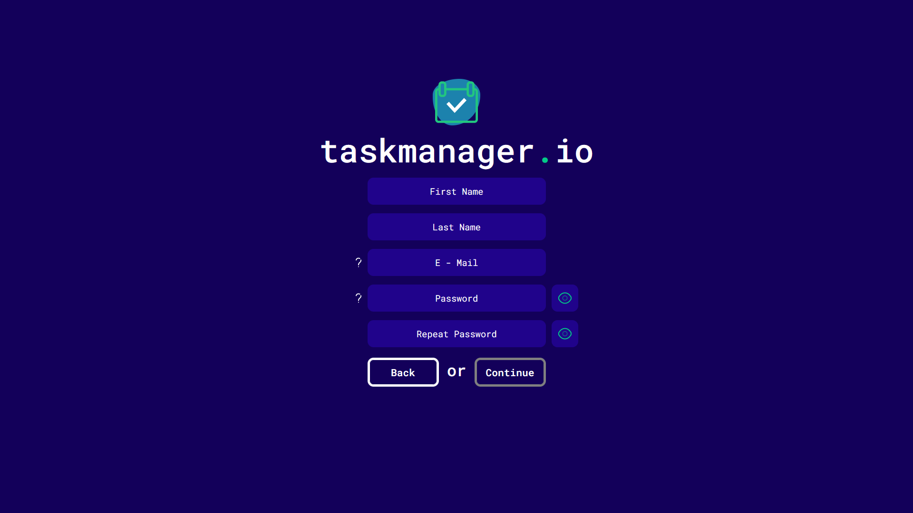
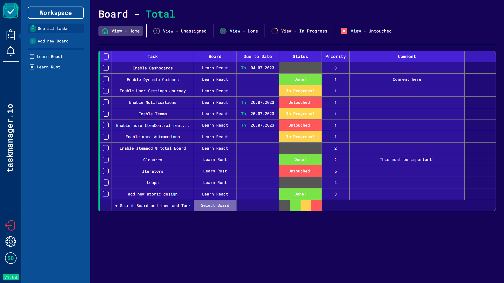

# taskmanager.io

 **Introduction** 

A **simplified** clone of the project management tool ["_monday.com_"](https://monday.com/lang/de/work-management).

Once logged in - you can manage tasks by dividing them into boards, assigning properties like due to date, status and more, filtering them by selecting a view, managing them cross-board, updating values with a nice multi-selection tool, and automating deletion with special status configuration. Quick, Easy no strings attached - more details below!

 **Gallery** 

 **Navigation** 

<u>**Fixed Routes:**</u>

Entry - https://taskmanager-io.web.app/public/entry\
Login - https://taskmanager-io.web.app/public/login\
Register - https://taskmanager-io.web.app/public/register\
See all Tasks - https://taskmanager-io.web.app/private/{UID}/total\

<u>**Dynamic Routes:**</u>

Individual Board - https://taskmanager-io.web.app/private/{UID}/board/{BOARDID}

**Features**

 <u>**Routing and Authentication**</u> 

Auth is provided by firebase and is persisted. Once logged in, if no explicit logout is performed you will be permanantly logged in!

 <u>**Public Pages**</u> 

- Entry
  - when the animation ended, the viewport is clickable for a redirect to the login page
- Login
- Register

 <u>**Private Pages**</u> 

- for dynamic and total
  - text
- only for total
  - text

**Future**

 **Tech Stack** 

**Frontend:** React (+React Router), Typescript, Sass\
**Backend:** Firebase (Auth, Firestore)
